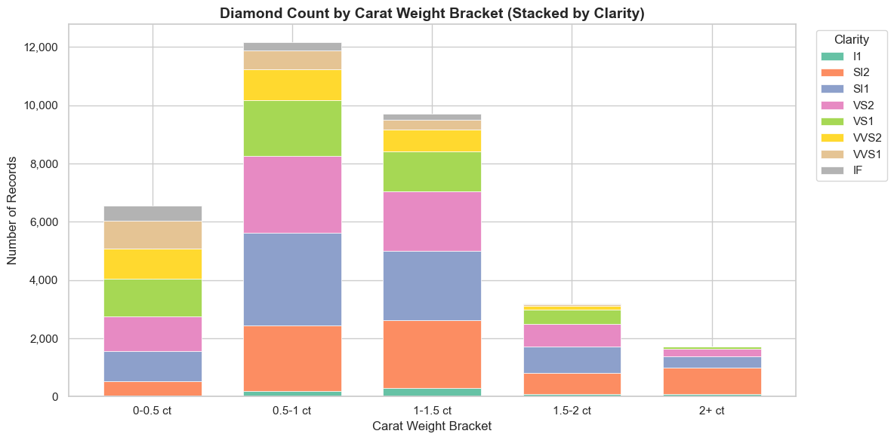
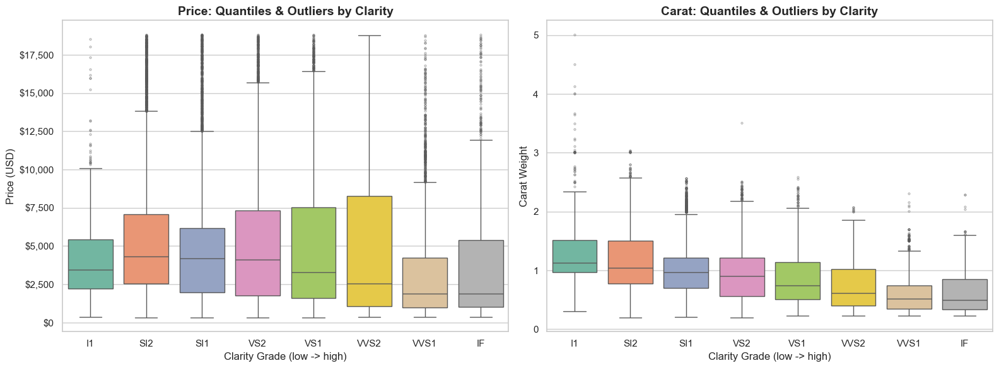
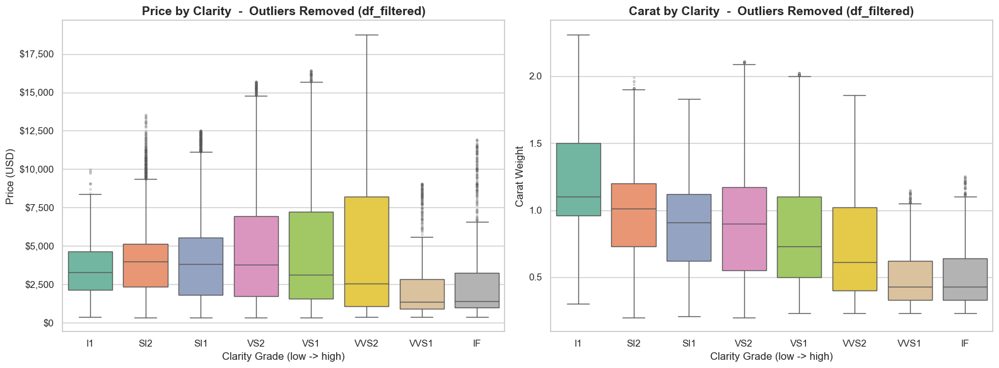
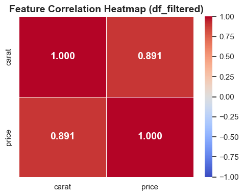
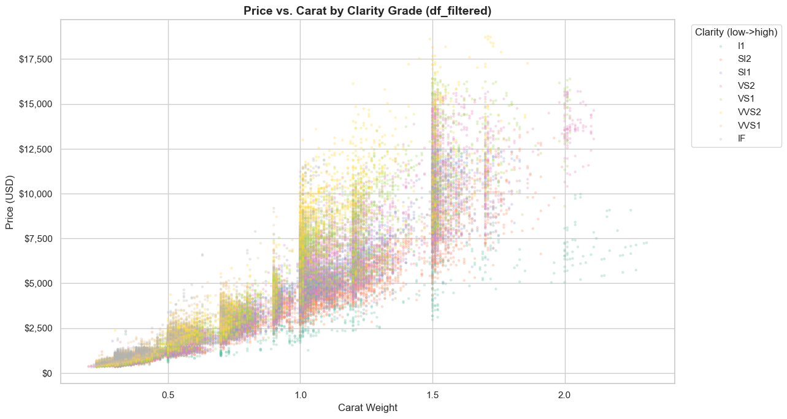
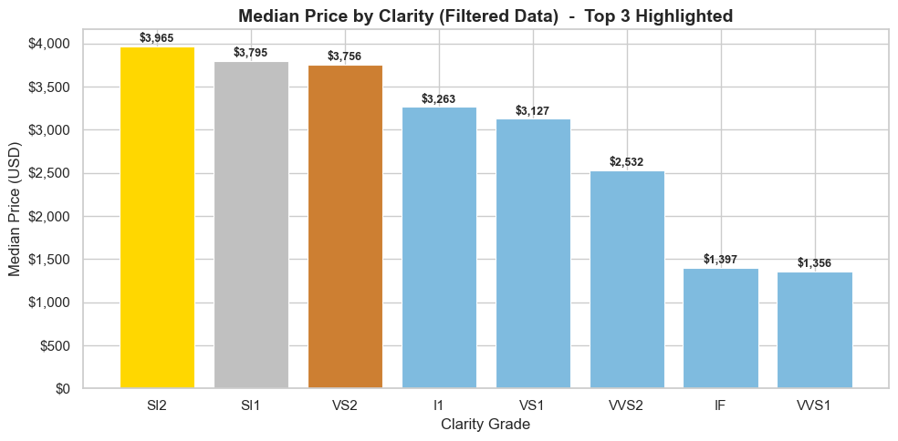
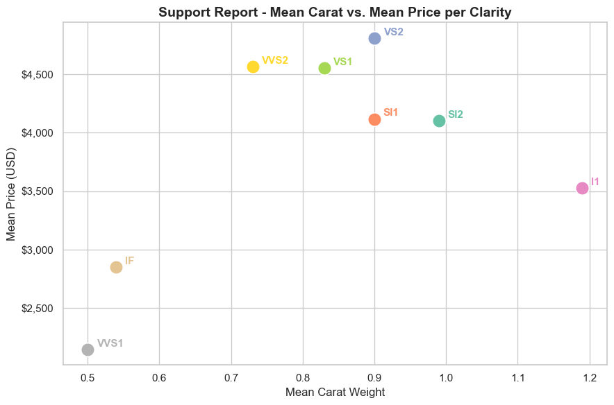
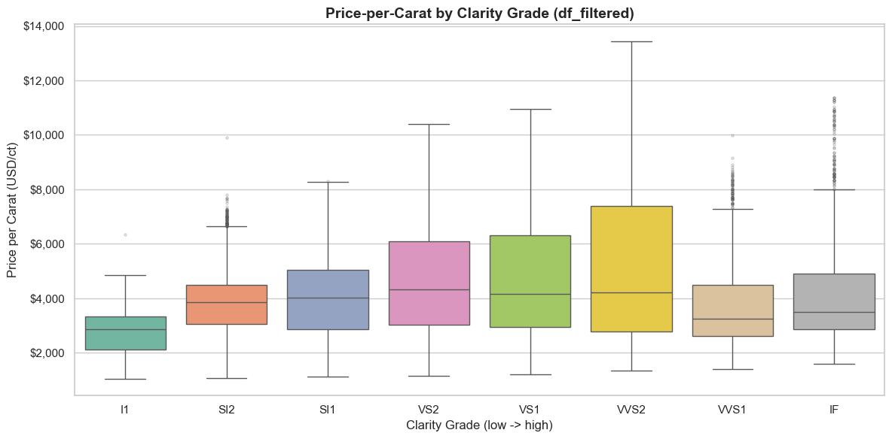
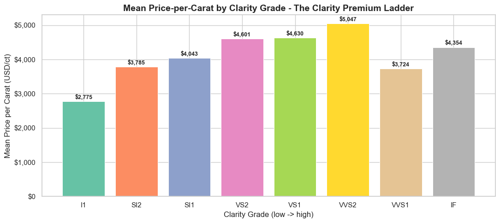

# Diamond Pricing - Exploratory Data Analysis

EDA of the **P2-Mispriced-Diamonds** dataset for the [Wilcore Technologies Data Scientist 2 challenge](https://workforcenow.adp.com/mascsr/default/mdf/recruitment/recruitment.html?cid=f7dc51cf-bcd4-4d90-8703-f151ed980046&ccId=9201427462023_3&lang=en_US&jobId=559006&jwId=9201427462023_1).

Full requirements are in [Request.md](https://github.com/akaseahawk/wilcore-interview-DS2/blob/main/Request.md).

---

## Quick Start

```bash
git clone https://github.com/akaseahawk/wilcore-interview-DS2.git
cd wilcore-interview-DS2
pip install pandas numpy matplotlib seaborn jupyter
jupyter notebook diamond_analysis.ipynb
```

No Jupyter? Open `diamond_analysis.html` in any browser to view the fully executed notebook with all outputs and charts rendered.

---

## Repository Contents

| File | Description |
|------|-------------|
| `P2-Mispriced-Diamonds.csv` | Raw dataset - 53,940 rows, 3 columns (carat, clarity, price) |
| `diamond_analysis.ipynb` | Main analysis notebook, fully executed with all outputs |
| `diamond_analysis.html` | Static HTML export - no Jupyter required to view |
| `Request.md` | Original challenge requirements |
| `charts/` | PNG exports of all charts generated in the notebook |

---

## Notebook Walkthrough

**Section 1 - Ingestion**
Reads the CSV and confirms the load.

**Section 2 - Discovery**
Reports shape, dtypes, missing value counts, and clarity distribution. No missing values were found; `clarity` was the only column requiring a type change (object to ordered category). Price is heavily right-skewed: standard deviation ($3,989) exceeds the mean ($3,933), and the median ($2,401) is the more representative measure of a typical stone's price.

**Section 3 - Data Cleaning**
- `carat` cast to float64, `price` cast to int64
- `clarity` cast to an ordered categorical with grades ranked from IF (best) to I1 (worst), enabling correct sorting and comparison across quality grades
- 20,584 exact duplicate rows removed, leaving 33,356 clean rows
- Post-dedup null check (zero nulls confirmed)

**Section 4 - Summary Statistics**
Mean and standard deviation for `carat` and `price` grouped by `clarity`, with rows ordered from best to worst grade (IF down to I1). Note: the table shows lower-clarity grades (SI1, SI2) with higher average prices than premium grades - this is carat confounding, not a data error. Worse-clarity diamonds tend to be physically larger (SI2 avg 1.16 ct vs IF avg 0.62 ct), and carat weight is the dominant price driver. Price-per-carat (Section 8) corrects for this.

The chart below shows diamond counts by carat weight bracket (0-0.5 ct, 0.5-1 ct, 1-1.5 ct, 1.5-2 ct, 2+ ct), stacked by clarity grade. It illustrates how lower-clarity grades (SI1, SI2, I1) dominate the heavier weight brackets, which is the root cause of the price paradox in the notebook summary table.



**Section 5 - Exploratory Visualizations**
Box plots show quantiles and outliers for price and carat per clarity grade. Outliers are then removed using the IQR method applied independently per clarity group (not globally), producing **`df_filtered`** with 30,784 rows.





**Section 6 - Relationships in Filtered Data**
Pearson correlation heatmap (carat vs price r = 0.891). Scatter plot of price vs. carat colored by clarity reveals substantial overlap between adjacent grades - the primary source of mispricing in the dataset.





**Section 7 - Business Questions**
Answers derived from a `support_report` DataFrame containing price_mean, price_median, and carat_mean per clarity on `df_filtered`. Q1 uses median price (more representative given right skew); Q2 uses mean price and mean carat.

Top 3 clarity categories by highest median price (SI2, SI1, VS2 - driven by larger stone sizes in those grades):



Mean price vs mean carat per clarity (support report):



**Section 8 - Price-per-Carat Analysis**
Derives a `price_per_carat` feature (price / carat) to isolate the clarity premium from size effects. Raw median price incorrectly ranks SI1/SI2 highest because those stones tend to be larger. Price-per-carat correctly surfaces VVS2, VS1, and VS2 at the top, reflecting the true clarity premium hierarchy. Also reveals that VVS1 trades at a lower price-per-carat than SI1 - a genuine mispricing anomaly in the data.





**Section 9 - Summary**
Single cell to summarize results and findings.
---

## Assumptions

**Duplicates are artifacts, not repeated observations.**
38% of the raw dataset (20,584 rows) are exact duplicates across all three columns. These are treated as data-entry errors and removed. If repeat observations were intentional (e.g., the same diamond appraised multiple times), the cleaning step would need revision.

**IQR outlier removal is applied per clarity group.**
Each clarity grade has its own carat and price distribution. A global IQR threshold would be too aggressive for high-clarity grades and too lenient for lower-clarity ones.

**Clarity is treated as an ordered category.**
Clarity is encoded as an ordered categorical (IF best, I1 worst) to enable correct grade-based sorting throughout the analysis. No numeric encoding is applied.

**Median is used for price comparisons, not mean.**
Price is heavily right-skewed (std > mean). Median is the more representative central tendency measure and is used in the support_report and Q1 answer.

**"Mispriced" refers to overlap zones between clarity tiers.**
The dataset name implies pricing anomalies. The analysis targets zones where adjacent clarity grades command indistinguishable average prices for the same carat weight.

---

## Dependencies

| Library | Purpose |
|---------|---------|
| `pandas` | Data loading, cleaning, groupby aggregations |
| `numpy` | Numeric operations, random seed |
| `matplotlib` | Base plotting and tick formatting |
| `seaborn` | Statistical visualizations (boxplots, heatmap, scatter) |
| `jupyter` | Notebook environment |
